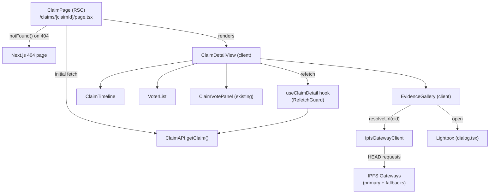

# Design Document: Claim Detail Route

## Overview

The `/claims/[claimId]` page is expanded from a stub into a full claim detail view. The page fetches enriched claim data (evidence CIDs, timeline events, voters) from the backend, renders an IPFS-backed evidence gallery with multi-gateway failover, a chronological on-chain timeline, a voter identity list with privacy controls, and the existing `ClaimVotePanel`. It handles 404s via Next.js `notFound()`, sanitizes user-provided text with DOMPurify, enforces a 10-second client-side refetch guard, and emits privacy-safe Open Graph metadata.

The implementation is entirely within the Next.js 14 App Router frontend. No backend changes are required beyond the API contract described in the data model section.

---

## Architecture

The page is a **React Server Component** (RSC) that performs the initial data fetch server-side. Client-side interactivity (gallery, lightbox, refetch guard) lives in dedicated `'use client'` components.



**Key design decisions:**

- The RSC handles the initial fetch and 404 detection, keeping the happy-path HTML fully server-rendered for SEO and OG tags.
- `ClaimDetailView` is a thin client shell that owns refetch state; all sub-components receive data as props.
- `IpfsGatewayClient` is a plain async module (not a React hook) so it can be unit-tested without a DOM.
- The `Lightbox` wraps the existing `dialog.tsx` Radix primitive rather than introducing a new dependency.

---

## Components and Interfaces

### `IpfsGatewayClient` (`frontend/src/lib/ipfs-gateway-client.ts`)

```ts
export function buildGatewayList(): string[]
export async function resolveUrl(cid: string): Promise<string | null>
```

- `buildGatewayList()` reads `NEXT_PUBLIC_IPFS_GATEWAY` as the first entry, then parses `NEXT_PUBLIC_IPFS_GATEWAY_FALLBACKS` (comma-separated), then appends hardcoded public fallbacks (`https://cloudflare-ipfs.com/ipfs`, `https://gateway.pinata.cloud/ipfs`).
- `resolveUrl(cid)` iterates the gateway list, issuing a `HEAD` request with an 8-second `AbortController` timeout per gateway. Returns the first URL that responds with a non-error status, or `null` if all fail.

### `EvidenceGallery` (`frontend/src/components/claims/evidence-gallery.tsx`)

Props: `{ imageUrls: string[]; claimId: string }`

- Resolves each CID via `IpfsGatewayClient.resolveUrl` in parallel on mount.
- Renders skeleton placeholders while resolving.
- Renders a responsive CSS grid (1 col on mobile, 3 cols on `sm+`).
- On thumbnail click/keypress, opens `Lightbox` with the selected index.
- On load error, shows a "Image unavailable" placeholder.
- Empty state: "No evidence submitted".

### `Lightbox` (`frontend/src/components/claims/lightbox.tsx`)

Props: `{ images: Array<{ url: string; alt: string }>; initialIndex: number; open: boolean; onClose: () => void }`

- Wraps `DialogContent` from `dialog.tsx` with `hideCloseButton` and a custom close button labelled "Close lightbox".
- Renders previous/next buttons when `images.length > 1`.
- Keyboard: Escape → close (handled by Radix), ArrowLeft/ArrowRight → navigate.
- Returns focus to the triggering thumbnail on close via a `ref` passed from `EvidenceGallery`.

### `ClaimTimeline` (`frontend/src/components/claims/claim-timeline.tsx`)

Props: `{ events: ClaimTimelineEvent[]; loading?: boolean }`

- Renders an `<ol role="list">` of timeline steps.
- Each step with a `txHash` renders a link to `${getConfig().explorerBase}/${txHash}`.
- Skeleton state when `loading` is true.
- Empty state: "No events recorded".

### `VoterList` (`frontend/src/components/claims/voter-list.tsx`)

Props: `{ voters: ClaimVoter[] }`

- Truncates public addresses: `addr.slice(0,6) + '…' + addr.slice(-4)`.
- Renders "Anonymous voter" for `isPublic === false`.
- Renders vote direction badge (Approve / Reject) per voter.
- Empty state: "No votes recorded".

### `ClaimDetailView` (`frontend/src/components/claims/claim-detail-view.tsx`)

Props: `{ initialClaim: Claim; claimId: string }`

- `'use client'` component.
- Owns the `useClaimDetail` hook for client-side refetching.
- Renders `EvidenceGallery`, `ClaimTimeline`, `VoterList`, `ClaimVotePanel`.
- Passes sanitized description to a `<div dangerouslySetInnerHTML>`.

### `useClaimDetail` (`frontend/src/lib/hooks/use-claim-detail.ts`)

```ts
export function useClaimDetail(claimId: string, initialClaim: Claim): {
  claim: Claim;
  refetch: () => void;
}
```

- Stores last-fetch timestamp in a `useRef`.
- `refetch()` is a no-op if fewer than 10 seconds have elapsed since the last fetch.
- Clears any pending `setTimeout` on unmount.
- Initial load uses `initialClaim` from SSR; does not count against the guard.

### `sanitize` (`frontend/src/lib/sanitize.ts`)

```ts
export function sanitize(html: string): string
```

- Wraps `DOMPurify.sanitize` with a strict allowlist (no `<script>`, `<iframe>`, `<object>`, `<embed>`, `<form>`, no event-handler attributes).
- Returns the input unchanged when it contains no HTML tags.

### `ClaimPage` (`frontend/src/app/claims/[claimId]/page.tsx`)

- RSC. Calls `ClaimAPI.getClaim(id)`. On `error.status === 404`, calls `notFound()`.
- Exports `generateMetadata` for OG tags: `og:title`, `og:description` (sanitized, ≤160 chars), `og:url`. Does not include voter addresses, `evidenceHash`, or raw CIDs.

---

## Data Models

### Extended `Claim` interface (`frontend/src/lib/api/claim.ts`)

```ts
export interface ClaimTimelineEvent {
  status: string;          // e.g. "filed" | "vote_cast" | "finalized" | "payout"
  ledger: number;
  txHash?: string;
}

export interface ClaimVoter {
  address: string;
  vote: 'approve' | 'reject';
  isPublic: boolean;
}

export interface Claim {
  id: number;
  policyId: string;
  creatorAddress: string;
  status: 'PENDING' | 'APPROVED' | 'REJECTED' | 'PAID';
  amount: string;
  description?: string;
  evidenceHash: string | null;       // NEW: SHA-256 hex or null
  createdAt: string;
  updatedAt: string;
  // ── New fields ──────────────────────────────────────────────────────────
  imageUrls: string[];               // IPFS CIDs or gateway URLs
  createdAtLedger: number;           // ledger sequence at filing
  timelineEvents: ClaimTimelineEvent[];
  voters: ClaimVoter[];
}
```

### `ClaimAPI.getClaim` error contract

```ts
// When the backend returns 404:
const err = new Error('Claim not found') as Error & { status: number }
err.status = 404
throw err
```

### Environment variables

| Variable | Purpose | Default |
|---|---|---|
| `NEXT_PUBLIC_IPFS_GATEWAY` | Primary gateway base URL | `https://ipfs.io/ipfs` |
| `NEXT_PUBLIC_IPFS_GATEWAY_FALLBACKS` | Comma-separated fallback URLs | `https://cloudflare-ipfs.com/ipfs,https://gateway.pinata.cloud/ipfs` |

`NEXT_PUBLIC_IPFS_GATEWAY_FALLBACKS` is added to `env.ts` as an optional string (no Zod URL validation since it's a comma-separated list; individual URLs are validated at runtime in `IpfsGatewayClient`).

---

## Correctness Properties

*A property is a characteristic or behavior that should hold true across all valid executions of a system — essentially, a formal statement about what the system should do. Properties serve as the bridge between human-readable specifications and machine-verifiable correctness guarantees.*

### Property 1: Claim type includes all required new fields

*For any* object returned by `ClaimAPI.getClaim`, the object SHALL have an `imageUrls` array, an `evidenceHash` field (string or null), a `createdAtLedger` number, a `timelineEvents` array where each entry has `status` (string) and `ledger` (number), and a `voters` array where each entry has `address` (string), `vote` ("approve" | "reject"), and `isPublic` (boolean).

**Validates: Requirements 1.1, 1.2, 1.3, 1.4, 1.5**

---

### Property 2: Gateway list starts with primary and has at least three entries

*For any* configuration of `NEXT_PUBLIC_IPFS_GATEWAY`, `buildGatewayList()` SHALL return a list whose first element equals the configured primary gateway URL and whose length is at least 3.

**Validates: Requirements 2.1**

---

### Property 3: Gateway failover tries next on error

*For any* CID and any gateway list where the first N gateways fail (N < list length), `resolveUrl(cid)` SHALL return a URL from a gateway at index ≥ N, never from a failed gateway.

**Validates: Requirements 2.2, 2.3**

---

### Property 4: Gateway list respects NEXT_PUBLIC_IPFS_GATEWAY_FALLBACKS

*For any* value of `NEXT_PUBLIC_IPFS_GATEWAY_FALLBACKS` containing a comma-separated list of valid URLs, `buildGatewayList()` SHALL include those URLs in the list (after the primary). When the variable is absent, the list SHALL include the hardcoded default fallbacks.

**Validates: Requirements 2.5**

---

### Property 5: Evidence gallery renders one lazy thumbnail per image URL

*For any* non-empty `imageUrls` array, the `EvidenceGallery` SHALL render exactly `imageUrls.length` `` elements, each with `loading="lazy"` and a non-null `alt` attribute (either descriptive or empty string).

**Validates: Requirements 3.1, 3.2, 3.3**

---

### Property 6: Lightbox shows navigation controls for multi-image sets

*For any* images array with length > 1, the `Lightbox` SHALL render both a "previous" and a "next" navigation control when open.

**Validates: Requirements 4.4**

---

### Property 7: Lightbox navigation advances to adjacent image

*For any* images array of length N and any current index i (0 ≤ i < N), activating the "next" control SHALL display the image at index (i + 1) % N, and activating "previous" SHALL display the image at index (i - 1 + N) % N, without closing the overlay.

**Validates: Requirements 4.5**

---

### Property 8: Timeline renders events in input order

*For any* `timelineEvents` array, the `ClaimTimeline` SHALL render the events in the same order as the input array (first event first, last event last).

**Validates: Requirements 5.1**

---

### Property 9: Timeline renders explorer links for events with txHash

*For any* `timelineEvents` entry that includes a `txHash`, the rendered link's `href` SHALL equal `${getConfig().explorerBase}/${txHash}`.

**Validates: Requirements 5.3**

---

### Property 10: Public voter address is truncated correctly

*For any* `ClaimVoter` with `isPublic === true` and an `address` of length ≥ 10, the displayed string SHALL equal `address.slice(0, 6) + '…' + address.slice(-4)`.

**Validates: Requirements 6.1**

---

### Property 11: Private voter displays "Anonymous voter"

*For any* `ClaimVoter` with `isPublic === false`, the rendered voter entry SHALL display the text "Anonymous voter" and SHALL NOT display any portion of the voter's `address`.

**Validates: Requirements 6.2**

---

### Property 12: Vote direction is always displayed

*For any* `ClaimVoter` (regardless of `isPublic`), the rendered voter entry SHALL display either "Approve" or "Reject" matching the voter's `vote` field.

**Validates: Requirements 6.3**

---

### Property 13: Sanitizer removes dangerous HTML

*For any* string containing `<script>`, `<iframe>`, `<object>`, `<embed>`, `<form>` elements, or event-handler attributes (e.g. `onclick`, `onerror`), `sanitize(input)` SHALL return a string that contains none of those elements or attributes.

**Validates: Requirements 8.1, 8.2**

---

### Property 14: Sanitizer is identity on plain text

*For any* string that contains no HTML tags, `sanitize(s)` SHALL return a string equal to `s`.

**Validates: Requirements 8.3**

---

### Property 15: Refetch guard enforces 10-second minimum interval

*For any* sequence of `refetch()` calls where two calls are made within 10 seconds of each other, the number of actual network requests issued SHALL be 1 (the second call returns the cached response).

**Validates: Requirements 9.1, 9.2**

---

### Property 16: OG title contains claim ID and status

*For any* claim with a given `id` and `status`, the `og:title` meta tag content SHALL contain both the claim ID and the status string.

**Validates: Requirements 10.1**

---

### Property 17: OG description is sanitized and truncated

*For any* claim `description`, the `og:description` meta tag content SHALL equal `sanitize(description).slice(0, 160)` (or the full sanitized string if shorter than 160 characters).

**Validates: Requirements 10.2**

---

### Property 18: OG tags contain no private data

*For any* claim with voters and evidence, none of the OG meta tag content values SHALL contain any voter wallet address, the `evidenceHash` value, or any raw IPFS CID from `imageUrls`.

**Validates: Requirements 10.3, 10.4**

---

### Property 19: OG url is the canonical absolute URL

*For any* claim with ID `claimId`, the `og:url` meta tag content SHALL equal the absolute URL `https://{host}/claims/{claimId}`.

**Validates: Requirements 10.5**

---

## Error Handling

| Scenario | Handling |
|---|---|
| `getClaim` returns 404 | `ClaimAPI` throws `{ status: 404 }` error; RSC calls `notFound()`; Next.js renders 404 page |
| `getClaim` returns other HTTP error | Error boundary catches; `ClaimDetailView` shows generic error message |
| All IPFS gateways fail for a CID | `resolveUrl` returns `null`; `EvidenceGallery` renders "Image unavailable" placeholder |
| Individual image load error (`onError`) | `EvidenceGallery` swaps `` for placeholder inline |
| Refetch while guard is active | `useClaimDetail` returns cached claim silently; no error surfaced |
| `sanitize` called with null/undefined | Guard clause returns empty string; no DOMPurify call |
| `NEXT_PUBLIC_IPFS_GATEWAY_FALLBACKS` malformed | Invalid URLs are filtered out at `buildGatewayList` time; valid entries are used |

---

## Testing Strategy

### Unit tests

Focus on specific examples, edge cases, and integration points:

- `IpfsGatewayClient`: all-gateways-fail returns null; single gateway success; timeout triggers fallover
- `sanitize`: plain text passthrough; script tag removal; event handler attribute removal; null/empty input
- `VoterList`: public address truncation format; anonymous voter display; empty voters empty state
- `ClaimTimeline`: empty events empty state; explorer link href format; loading skeleton presence
- `ClaimAPI.getClaim`: 404 response throws error with `status === 404`
- `useClaimDetail`: initial fetch does not count against guard; unmount clears timers
- `Lightbox`: close button aria-label; aria-modal and role attributes; navigation absent for single image
- `ClaimPage` (RSC): `notFound()` called on 404; OG tags present and correct format

### Property-based tests

Use **fast-check** (already compatible with the Jest/Vitest setup in the frontend).

Configure each test with a minimum of **100 runs** (`{ numRuns: 100 }`).

Each test is tagged with a comment in the format:
`// Feature: claim-detail-route, Property N: <property text>`

| Property | Test description |
|---|---|
| P1: Claim type fields | Generate random API response objects; verify all new fields parse correctly |
| P2: Gateway list starts with primary | Arbitrary primary URL → `buildGatewayList()[0]` equals it; length ≥ 3 |
| P3: Gateway failover | Arbitrary CID + failure pattern → result never from a failed gateway |
| P4: Fallbacks env var | Arbitrary comma-separated URL list → all valid URLs appear in gateway list |
| P5: Gallery thumbnail count | Arbitrary `imageUrls` arrays → rendered img count equals array length; all have `loading="lazy"` |
| P6: Lightbox nav controls | Arbitrary images arrays length > 1 → both nav controls present |
| P7: Lightbox navigation | Arbitrary index + direction → correct next/prev index with wrap-around |
| P8: Timeline order | Arbitrary event arrays → rendered order matches input order |
| P9: Timeline explorer links | Arbitrary events with txHash → href equals `explorerBase/txHash` |
| P10: Public address truncation | Arbitrary addresses ≥ 10 chars → truncation formula holds |
| P11: Anonymous voter | Arbitrary voters with `isPublic=false` → "Anonymous voter" shown, address absent |
| P12: Vote direction display | Arbitrary voters → vote direction always shown |
| P13: Sanitizer removes dangerous HTML | Arbitrary strings with injected script/iframe/event-handlers → absent from output |
| P14: Sanitizer plain text identity | Arbitrary plain-text strings (no `<` or `>`) → `sanitize(s) === s` |
| P15: Refetch guard | Arbitrary call sequences within 10s window → only 1 network request |
| P16: OG title format | Arbitrary claim id + status → both present in og:title |
| P17: OG description truncation | Arbitrary descriptions → og:description ≤ 160 chars and equals sanitized slice |
| P18: OG privacy | Arbitrary claims with voters/evidence → no private data in any OG tag |
| P19: OG url format | Arbitrary claimId → og:url equals absolute canonical URL |
