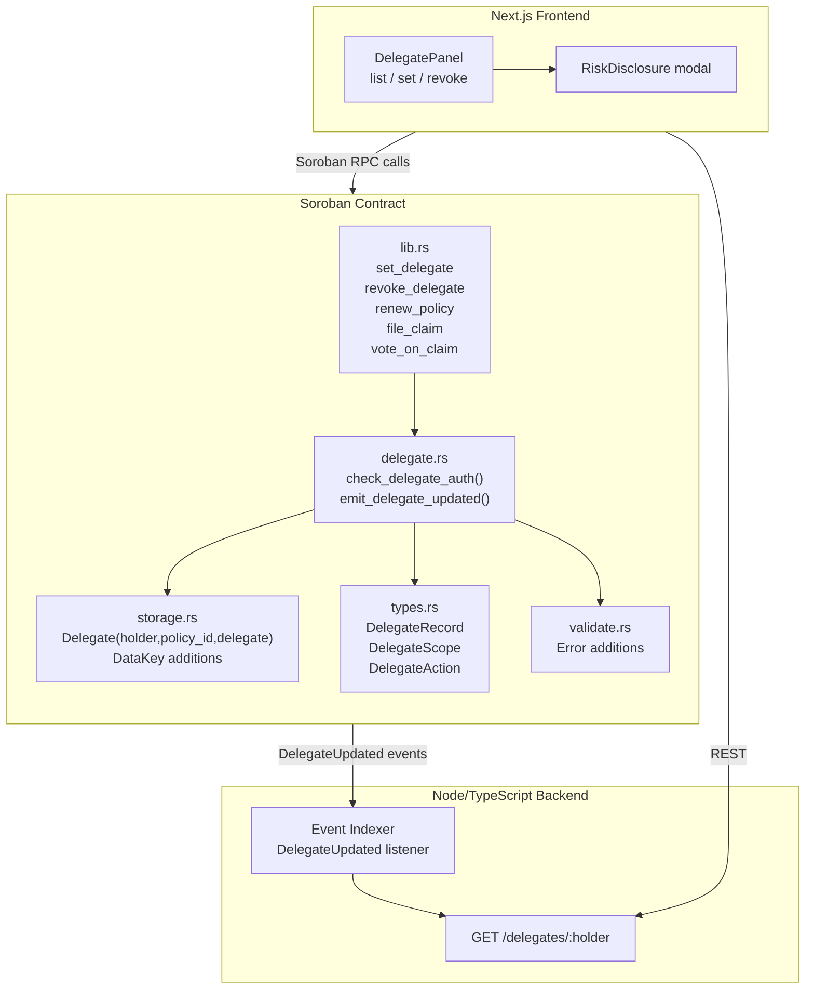
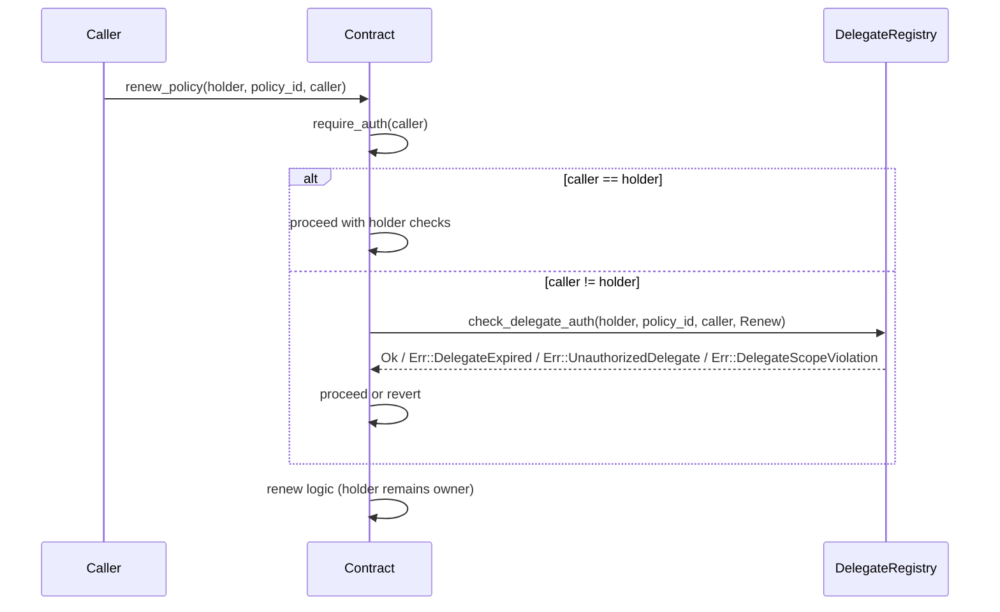

# Design Document: Delegate Authorization

## Overview

The delegate authorization feature adds a scoped, time-bounded delegation layer to the NiffyInsure
Soroban smart contract. A policyholder (the "Holder") can register a trusted address (the
"Delegate") to perform a restricted set of actions — renewing coverage and filing claims — on one
or more of their policies without exposing the Holder's cold key for routine operations.

The feature spans four layers:

| Layer | Scope |
|---|---|
| Soroban contract (`contracts/niffyinsure/src/`) | New `delegate.rs` module; additions to `storage.rs`, `types.rs`, `validate.rs`, `lib.rs` |
| Integration tests (`contracts/niffyinsure/tests/`) | New `delegate.rs` test file using `soroban-sdk` test harness |
| Node/TypeScript backend (`backend/src/`) | New `/delegates/:holder` endpoint; `DelegateUpdated` event indexer |
| Next.js frontend (`frontend/src/`) | Delegate management panel with risk disclosure and revocation UI |

Key design constraints:
- Delegates can never vote, redirect payouts, or modify delegate assignments.
- All authorization checks happen before any storage write (fail-fast).
- `require_auth` is called on the actual transaction signer in every entrypoint.
- Multisig Holders are supported transparently via Soroban's native auth resolution.

---

## Architecture



### Authorization Flow



---

## Components and Interfaces

### 1. `types.rs` additions

```rust
/// Bitmask of permitted delegate actions.
/// Stored as a u32 to remain XDR-serialisable.
#[contracttype]
#[derive(Clone, PartialEq, Debug)]
pub enum DelegateScope {
    None,       // no permissions (used in Revoked events)
    Renew,      // may call renew_policy
    FileClaim,  // may call file_claim
    RenewAndFileClaim, // both
}

/// Discriminant carried in DelegateUpdated events.
#[contracttype]
#[derive(Clone, PartialEq, Debug)]
pub enum DelegateAction {
    Set,
    Revoked,
}

/// Stored on-chain per (holder, policy_id, delegate) triple.
#[contracttype]
#[derive(Clone)]
pub struct DelegateRecord {
    pub expiry_ledger: u32,
    pub scope: DelegateScope,
}
```

### 2. `storage.rs` additions

New `DataKey` variants:

```rust
/// Delegate_Record keyed by (holder, policy_id, delegate).
Delegate(Address, u32, Address),
```

New helper functions:

```rust
pub fn set_delegate(env: &Env, holder: &Address, policy_id: u32, delegate: &Address, record: &DelegateRecord);
pub fn get_delegate(env: &Env, holder: &Address, policy_id: u32, delegate: &Address) -> Option<DelegateRecord>;
pub fn remove_delegate(env: &Env, holder: &Address, policy_id: u32, delegate: &Address);
```

Storage tier: `persistent()` — delegate records must survive ledger archival windows.

### 3. `delegate.rs` (new module)

```rust
/// Verifies that `caller` is authorised to perform `action` on `(holder, policy_id)`.
/// Returns Ok(()) if caller == holder (bypasses delegate lookup).
/// Otherwise looks up the DelegateRecord and checks expiry and scope.
pub fn check_delegate_auth(
    env: &Env,
    holder: &Address,
    policy_id: u32,
    caller: &Address,
    required_scope: DelegateScope,
) -> Result<(), Error>;

/// Emits a `DelegateUpdated` contract event.
pub fn emit_delegate_updated(
    env: &Env,
    holder: &Address,
    policy_id: u32,
    delegate: &Address,
    expiry_ledger: u32,
    scope: DelegateScope,
    action: DelegateAction,
);
```

`check_delegate_auth` logic (ordered, fail-fast):
1. If `caller == holder` → return `Ok(())`.
2. Load `DelegateRecord` for `(holder, policy_id, caller)`. If absent → `Err(UnauthorizedDelegate)`.
3. If `env.ledger().sequence() >= record.expiry_ledger` → `Err(DelegateExpired)`.
4. If `record.scope` does not cover `required_scope` → `Err(DelegateScopeViolation)`.
5. Return `Ok(())`.

### 4. `validate.rs` additions

```rust
// New error variants
pub enum Error {
    // ... existing variants ...
    DelegateExpiredWindow,   // set_delegate called with expiry_ledger <= current_ledger
    DelegateExpired,         // caller's record exists but is past expiry
    UnauthorizedDelegate,    // no record found for caller
    DelegateScopeViolation,  // record exists but scope doesn't cover the action
    NotAVoter,               // vote_on_claim caller holds no active policy as direct holder
    InvalidPayoutAddress,    // file_claim payout address != policy.holder
}
```

### 5. `lib.rs` new entrypoints

```rust
/// Register or update a delegate for a specific policy.
pub fn set_delegate(
    env: Env,
    holder: Address,
    policy_id: u32,
    delegate: Address,
    expiry_ledger: u32,
    scope: DelegateScope,
) -> Result<(), Error>;

/// Remove a delegate record for a specific policy.
pub fn revoke_delegate(
    env: Env,
    holder: Address,
    policy_id: u32,
    delegate: Address,
) -> Result<(), Error>;
```

Modifications to existing entrypoints:

- `renew_policy(env, holder, policy_id, caller)` — adds `caller: Address` parameter; calls
  `require_auth(&caller)` then `check_delegate_auth(holder, policy_id, caller, Renew)`.
- `file_claim(env, holder, policy_id, caller, amount, details, image_urls)` — adds `caller:
  Address`; calls `require_auth(&caller)` then `check_delegate_auth(holder, policy_id, caller,
  FileClaim)`; derives payout recipient from `policy.holder` only.
- `vote_on_claim(env, voter, claim_id, vote)` — adds check that `voter` is a direct Holder of an
  active policy; rejects with `Error::NotAVoter` otherwise.

### 6. Backend: event indexer and REST endpoint

```typescript
// In-memory delegate index (replace with DB in production)
type DelegateIndex = Map<string, DelegateRecord[]>; // key: holder address

interface DelegateRecord {
  policyId: number;
  delegate: string;
  expiryLedger: number;
  scope: string;
}

// New route
app.get("/delegates/:holder", (req, res) => { ... });

// Event listener (Soroban RPC subscription or polling)
function handleDelegateUpdated(event: DelegateUpdatedEvent): void { ... }
```

### 7. Frontend: DelegatePanel component

New files:
- `frontend/src/app/components/DelegatePanel.tsx` — lists active delegates, expiry warnings,
  revoke button.
- `frontend/src/app/components/RiskDisclosure.tsx` — modal shown before `set_delegate` submission.

---

## Data Models

### On-chain storage layout

| DataKey | Storage tier | Value type | Notes |
|---|---|---|---|
| `Delegate(holder, policy_id, delegate)` | `persistent` | `DelegateRecord` | Removed on revoke |
| Existing keys unchanged | — | — | — |

### `DelegateRecord`

| Field | Type | Constraints |
|---|---|---|
| `expiry_ledger` | `u32` | Must be > `current_ledger` at write time |
| `scope` | `DelegateScope` | Must not be `None` at write time |

### `DelegateUpdated` event schema

| Field | Type | Set value | Revoked value |
|---|---|---|---|
| `holder` | `Address` | holder | holder |
| `policy_id` | `u32` | policy_id | policy_id |
| `delegate` | `Address` | delegate | delegate |
| `expiry_ledger` | `u32` | expiry_ledger | `0` |
| `scope` | `DelegateScope` | scope | `DelegateScope::None` |
| `action` | `DelegateAction` | `Set` | `Revoked` |

### Backend delegate index entry

```typescript
interface DelegateIndexEntry {
  holder: string;       // Stellar address
  policyId: number;
  delegate: string;     // Stellar address
  expiryLedger: number;
  scope: "Renew" | "FileClaim" | "RenewAndFileClaim";
}
```

---


## Correctness Properties

*A property is a characteristic or behavior that should hold true across all valid executions of a
system — essentially, a formal statement about what the system should do. Properties serve as the
bridge between human-readable specifications and machine-verifiable correctness guarantees.*

### Property 1: set_delegate round-trip

*For any* valid `(holder, policy_id, delegate, expiry_ledger, scope)` tuple where `expiry_ledger >
current_ledger`, calling `set_delegate` and then reading back the stored `DelegateRecord` should
return a record with the same `expiry_ledger` and `scope` that was written.

**Validates: Requirements 1.1**

---

### Property 2: set_delegate rejects past or current expiry_ledger

*For any* `set_delegate` call where `expiry_ledger <= current_ledger`, the contract SHALL reject
the call with `Error::DelegateExpiredWindow` and leave storage unchanged.

**Validates: Requirements 1.3**

---

### Property 3: revoke_delegate removes the record

*For any* `(holder, policy_id, delegate)` triple for which a `DelegateRecord` exists, calling
`revoke_delegate` should result in the record being absent from storage, such that a subsequent
authorization check returns `Error::UnauthorizedDelegate`.

**Validates: Requirements 1.4**

---

### Property 4: DelegateUpdated event is emitted with correct fields

*For any* valid `set_delegate` call, the emitted `DelegateUpdated` event should contain exactly the
`holder`, `policy_id`, `delegate`, `expiry_ledger`, and `scope` passed in, with `action = Set`.
*For any* valid `revoke_delegate` call, the emitted event should contain the same `holder`,
`policy_id`, and `delegate`, with `expiry_ledger = 0`, `scope = DelegateScope::None`, and `action
= Revoked`.

**Validates: Requirements 1.6, 8.1, 8.2**

---

### Property 5: Delegate with Renew scope can renew_policy

*For any* `(holder, policy_id, delegate)` triple where a non-expired `DelegateRecord` with
`DelegateScope::Renew` (or `RenewAndFileClaim`) exists, calling `renew_policy` with `caller =
delegate` should succeed.

**Validates: Requirements 2.1**

---

### Property 6: Delegate with FileClaim scope can file_claim

*For any* `(holder, policy_id, delegate)` triple where a non-expired `DelegateRecord` with
`DelegateScope::FileClaim` (or `RenewAndFileClaim`) exists, calling `file_claim` with `caller =
delegate` should succeed.

**Validates: Requirements 2.2**

---

### Property 7: Expired delegate is rejected before any state change

*For any* `(holder, policy_id, delegate)` triple where a `DelegateRecord` exists but
`current_ledger >= expiry_ledger`, calling `renew_policy` or `file_claim` as that delegate should
revert with `Error::DelegateExpired` and leave all storage unchanged.

**Validates: Requirements 2.4, 5.1**

---

### Property 8: Unknown delegate is rejected before any state change

*For any* caller address that is not the Holder and for which no `DelegateRecord` exists on the
target `(holder, policy_id)`, calling `renew_policy` or `file_claim` should revert with
`Error::UnauthorizedDelegate` and leave all storage unchanged.

**Validates: Requirements 2.5, 5.2**

---

### Property 9: Holder remains policy owner after delegate renew

*For any* `renew_policy` call where `caller` is a valid Delegate, the `policy.holder` field read
back after the call should equal the original Holder address, not the Delegate address.

**Validates: Requirements 2.6**

---

### Property 10: Claimant is always the Holder after delegate file_claim

*For any* `file_claim` call where `caller` is a valid Delegate, the `claim.claimant` field stored
on-chain should equal `policy.holder`, not the Delegate address.

**Validates: Requirements 2.7**

---

### Property 11: Payout recipient is always policy.holder

*For any* approved claim, the address receiving the token transfer should equal `policy.holder` for
that claim's policy, regardless of who filed the claim.

**Validates: Requirements 3.1**

---

### Property 12: file_claim rejects mismatched payout address

*For any* `file_claim` call that includes an explicit payout address field that differs from
`policy.holder`, the contract should reject the call with `Error::InvalidPayoutAddress` before
writing any state.

**Validates: Requirements 3.2**

---

### Property 13: vote_on_claim is restricted to direct Holders of active policies

*For any* address that does not hold at least one active policy as a direct Holder (including
Delegate addresses regardless of their scope), calling `vote_on_claim` should revert with
`Error::NotAVoter`.

**Validates: Requirements 4.1, 4.2, 4.3**

---

### Property 14: Scope violation is rejected before any state change

*For any* `(holder, policy_id, delegate)` triple where a valid non-expired `DelegateRecord` exists
but the `DelegateScope` does not cover the requested action (e.g., a `Renew`-only delegate calling
`file_claim`), the contract should revert with `Error::DelegateScopeViolation` before writing any
state.

**Validates: Requirements 5.3**

---

### Property 15: Holder always bypasses delegate lookup

*For any* `renew_policy` or `file_claim` call where `caller == holder`, the contract should
proceed with only Holder-level authorization checks and never consult the delegate registry, even
when no `DelegateRecord` exists.

**Validates: Requirements 5.4**

---

### Property 16: Delegate cannot modify delegate assignments

*For any* address that holds a `DelegateRecord` (regardless of scope), calling `set_delegate` or
`revoke_delegate` on any policy should fail because `require_auth` on the Holder will not be
satisfied by the Delegate's signature.

**Validates: Requirements 5.5**

---

### Property 17: Expiry warning threshold

*For any* `(current_ledger, expiry_ledger)` pair where `expiry_ledger - current_ledger < 1000`,
the frontend helper function `isNearExpiry` should return `true`; for pairs where the difference is
≥ 1000 it should return `false`.

**Validates: Requirements 7.5**

---

### Property 18: Backend removes revoked delegate from index

*For any* delegate entry present in the backend index, processing a `DelegateUpdated` event with
`action = Revoked` for that `(holder, policy_id, delegate)` triple should result in the entry
being absent from the index returned by `GET /delegates/:holder`.

**Validates: Requirements 8.4**

---

## Error Handling

### Contract errors

| Error | Trigger | State change |
|---|---|---|
| `DelegateExpiredWindow` | `set_delegate` called with `expiry_ledger <= current_ledger` | None |
| `DelegateExpired` | Caller's record exists but `current_ledger >= expiry_ledger` | None |
| `UnauthorizedDelegate` | No `DelegateRecord` found for `(holder, policy_id, caller)` | None |
| `DelegateScopeViolation` | Record exists but scope doesn't cover the requested action | None |
| `NotAVoter` | `vote_on_claim` caller holds no active policy as direct Holder | None |
| `InvalidPayoutAddress` | `file_claim` payout address field != `policy.holder` | None |

All new errors follow the existing pattern in `validate.rs`: they are returned as `Err(Error::X)`
and the contract panics via `unwrap()` or `expect()` at the call site in `lib.rs`, which causes
Soroban to revert the entire transaction. No partial writes occur.

### Backend errors

| Scenario | Response |
|---|---|
| Unknown holder in `GET /delegates/:holder` | `200 OK` with empty array (not 404) |
| Malformed event payload | Log warning, skip event, do not crash indexer |
| RPC connection failure | Retry with exponential back-off; surface `503` on REST if index is stale |

### Frontend errors

| Scenario | Handling |
|---|---|
| `set_delegate` transaction rejected by contract | Display contract error message; keep form open |
| `revoke_delegate` transaction rejected | Display error; do not close confirmation dialog |
| Backend `GET /delegates/:holder` fails | Show stale-data warning; disable revoke button |
| Wallet not connected | Disable delegate management panel; prompt connection |

---

## Testing Strategy

### Dual testing approach

Both unit/integration tests and property-based tests are required. They are complementary:
unit/integration tests catch concrete bugs and verify specific scenarios; property-based tests
verify universal correctness across randomized inputs.

### Contract: integration tests (`contracts/niffyinsure/tests/delegate.rs`)

Use the `soroban-sdk` test harness (`Env::default()`, `mock_all_auths()`,
`Address::generate(&env)`).

Unit/integration test cases (specific examples and edge cases):
- `set_delegate_requires_holder_auth` — call without holder auth, expect panic.
- `revoke_delegate_requires_holder_auth` — call without holder auth, expect panic.
- `multisig_holder_can_set_delegate` — use `mock_all_auths` to simulate multisig holder.
- `backend_get_delegates_returns_empty_for_unknown_holder` — REST example test.

Property-based tests use the [`proptest`](https://github.com/proptest-rs/proptest) crate (Rust).
Each test runs a minimum of 100 iterations.

```toml
# contracts/niffyinsure/Cargo.toml (dev-dependencies)
proptest = "1"
```

Property test stubs (one test per property, tagged with feature and property number):

```rust
// Feature: delegate-authorization, Property 1: set_delegate round-trip
proptest! {
    #[test]
    fn prop_set_delegate_round_trip(expiry_offset in 1u32..10_000u32, scope in any_scope()) { ... }
}

// Feature: delegate-authorization, Property 2: set_delegate rejects past expiry_ledger
proptest! {
    #[test]
    fn prop_set_delegate_rejects_past_expiry(offset in 0u32..1_000u32) { ... }
}

// Feature: delegate-authorization, Property 3: revoke removes record
proptest! {
    #[test]
    fn prop_revoke_removes_record(expiry_offset in 1u32..10_000u32) { ... }
}

// Feature: delegate-authorization, Property 4: DelegateUpdated event fields
proptest! {
    #[test]
    fn prop_delegate_updated_event_fields(expiry_offset in 1u32..10_000u32, scope in any_scope()) { ... }
}

// Feature: delegate-authorization, Property 7: expired delegate rejected
proptest! {
    #[test]
    fn prop_expired_delegate_rejected(expiry_offset in 1u32..100u32) { ... }
}

// Feature: delegate-authorization, Property 8: unknown delegate rejected
proptest! {
    #[test]
    fn prop_unknown_delegate_rejected() { ... }
}

// Feature: delegate-authorization, Property 9: holder remains owner after delegate renew
proptest! {
    #[test]
    fn prop_holder_remains_owner_after_delegate_renew(expiry_offset in 1u32..10_000u32) { ... }
}

// Feature: delegate-authorization, Property 10: claimant is holder after delegate file_claim
proptest! {
    #[test]
    fn prop_claimant_is_holder_after_delegate_file_claim(expiry_offset in 1u32..10_000u32) { ... }
}

// Feature: delegate-authorization, Property 11: payout recipient is policy.holder
proptest! {
    #[test]
    fn prop_payout_recipient_is_holder(expiry_offset in 1u32..10_000u32) { ... }
}

// Feature: delegate-authorization, Property 13: vote restricted to direct holders
proptest! {
    #[test]
    fn prop_vote_restricted_to_direct_holders() { ... }
}

// Feature: delegate-authorization, Property 14: scope violation rejected
proptest! {
    #[test]
    fn prop_scope_violation_rejected(expiry_offset in 1u32..10_000u32) { ... }
}

// Feature: delegate-authorization, Property 15: holder bypasses delegate lookup
proptest! {
    #[test]
    fn prop_holder_bypasses_delegate_lookup() { ... }
}

// Feature: delegate-authorization, Property 16: delegate cannot modify assignments
proptest! {
    #[test]
    fn prop_delegate_cannot_modify_assignments(expiry_offset in 1u32..10_000u32) { ... }
}
```

### Frontend: Jest + fast-check (`frontend/`)

```typescript
// Feature: delegate-authorization, Property 17: expiry warning threshold
fc.assert(fc.property(
  fc.integer({ min: 0 }), fc.integer({ min: 0 }),
  (current, expiry) => {
    const result = isNearExpiry(current, expiry);
    return result === (expiry - current < 1000 && expiry > current);
  }
), { numRuns: 100 });
```

### Backend: Jest + fast-check (`backend/`)

```typescript
// Feature: delegate-authorization, Property 18: backend removes revoked delegate
fc.assert(fc.property(
  fc.record({ holder: fc.string(), policyId: fc.nat(), delegate: fc.string(), ... }),
  (entry) => {
    addToIndex(entry);
    handleDelegateUpdated({ ...entry, action: "Revoked" });
    return getDelegates(entry.holder).every(d => d.delegate !== entry.delegate);
  }
), { numRuns: 100 });
```

### Coverage targets

- Contract: all new error variants exercised by at least one test.
- Backend: `GET /delegates/:holder` endpoint covered by integration example test.
- Frontend: `isNearExpiry` helper covered by property test; `DelegatePanel` and `RiskDisclosure`
  covered by React Testing Library snapshot tests.
