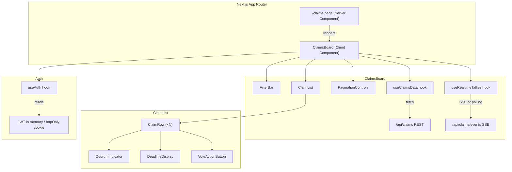

# Design Document: Claims Board

## Overview

The Claims Board is a paginated, filterable list view of all insurance claims. It aggregates claim data from the backend REST API, visualizes quorum progress and deadlines, surfaces claims that need the authenticated voter's attention, and keeps tallies fresh via SSE or resilient polling. The board is built as a Next.js 15 App Router page with React 19 client components, using the existing Radix UI / Tailwind / Zod stack already present in the project.

Key design goals:

- Correctness: deadline values come exclusively from server timestamps; JWT contents are never leaked into the DOM.
- Accessibility: WCAG 2.1 AA contrast, keyboard navigation, ARIA live regions for real-time updates.
- Performance: debounced filters, optional list virtualization, polling paused when tab is hidden.
- Shareability: active filter state is mirrored to URL query parameters.

---

## Architecture



The `/claims` page is a lightweight server component that passes no sensitive data to the client. All data fetching and state management lives in the `ClaimsBoard` client component and its hooks.

---

## Components and Interfaces

### ClaimsBoard

Top-level client component. Owns filter state, pagination state, and wires together all sub-components.

```ts
interface ClaimsBoardProps {
  // No required props — reads JWT from auth context, filters from URL
}
```

State:

- `filters: ClaimFilters` — current filter values
- `page: number` — current page (1-indexed)
- `claims: Claim[]` — current page of claims
- `totalPages: number`
- `loading: boolean`
- `error: string | null`

### FilterBar

```ts
interface FilterBarProps {
  filters: ClaimFilters;
  onChange: (filters: ClaimFilters) => void;
  showNeedsMyVote: boolean; // false when no JWT present
}
```

Renders status select, policy text input, date-range inputs, and (conditionally) the "Needs my vote" toggle. All controls are keyboard-operable. Filter changes are debounced 200 ms before triggering a fetch.

### ClaimRow

```ts
interface ClaimRowProps {
  claim: Claim;
  isAuthenticated: boolean;
  onVote?: (claimId: string) => void;
}
```

Renders a single claim's identifier, policy reference, status badge, tally summary, `QuorumIndicator`, and `DeadlineDisplay`. On mobile viewports it is a card; on desktop it is a table row.

### QuorumIndicator

```ts
interface QuorumIndicatorProps {
  approveVotes: number;
  rejectVotes: number;
  quorumThreshold: number;
}
```

Renders a progress bar plus a textual summary (e.g. "12 of 20 votes cast"). When `approveVotes + rejectVotes >= quorumThreshold`, renders a distinct "Quorum reached" label with a checkmark icon (non-color-only cue).

### DeadlineDisplay

```ts
interface DeadlineDisplayProps {
  deadlineTimestamp: string; // ISO-8601 from server
  indexerLagSeconds: number; // from config, default 30
}
```

Derives all display values from `deadlineTimestamp`. Shows a human-readable countdown + absolute date when deadline is in the future; shows "Voting closed" when past. Renders an indexer-lag disclaimer in proximity to the countdown.

### PaginationControls

```ts
interface PaginationControlsProps {
  page: number;
  totalPages: number;
  onPageChange: (page: number) => void;
}
```

### useClaimsData (hook)

```ts
function useClaimsData(
  filters: ClaimFilters,
  page: number,
): {
  claims: Claim[];
  totalPages: number;
  loading: boolean;
  error: string | null;
  retry: () => void;
};
```

Fetches from `GET /api/claims` with filter and pagination query params. Validates response with Zod.

### useRealtimeTallies (hook)

```ts
function useRealtimeTallies(
  claimIds: string[],
  onUpdate: (update: TallyUpdate) => void,
): void;
```

Attempts SSE connection to `/api/claims/events`. Falls back to polling with exponential backoff on failure. Pauses when `document.visibilityState === 'hidden'`. Cleans up on unmount.

### useAuth (hook)

```ts
function useAuth(): {
  jwt: string | null;
  isAuthenticated: boolean;
  onExpiry: () => void;
};
```

Reads JWT from in-memory store (never from `localStorage` or DOM attributes). Exposes `onExpiry` callback that deactivates the "Needs my vote" filter and prompts re-authentication.

### useQueryParamFilters (hook)

```ts
function useQueryParamFilters(): [ClaimFilters, (f: ClaimFilters) => void];
```

Reads initial filter state from URL search params on mount. Writes filter changes back to the URL using `router.replace` (no history entry per change).

---

## Data Models

### ClaimFilters

```ts
interface ClaimFilters {
  status: ClaimStatus | "all";
  policyRef: string;
  submittedAfter: string | null; // ISO-8601 date string
  submittedBefore: string | null; // ISO-8601 date string
  needsMyVote: boolean; // only active when JWT present
}
```

### ClaimsPage (API response)

```ts
interface ClaimsPage {
  claims: Claim[];
  page: number;
  totalPages: number;
  totalCount: number;
}
```

Validated with Zod against the existing `ClaimSchema` (from `@/lib/schemas/vote`).

### TallyUpdate (SSE event payload)

```ts
interface TallyUpdate {
  claimId: string;
  approveVotes: number;
  rejectVotes: number;
  status: ClaimStatus;
}
```

### Extended Claim fields needed for the board

The existing `ClaimSchema` covers most fields. The board additionally requires:

- `deadline_timestamp: string` — ISO-8601 server timestamp (replaces client-side ledger math for deadline display per Requirement 3.1)
- `quorum_threshold: number` — minimum votes for a valid decision

These will be added to `ClaimSchema` as optional fields with a Zod `.extend()` in the new `claims-board` schema file, keeping the existing schema intact.

### URL Query Parameter Mapping

| Filter field    | Query param     | Example              |
| --------------- | --------------- | -------------------- |
| status          | `status`        | `?status=open`       |
| policyRef       | `policy`        | `?policy=POL-123`    |
| submittedAfter  | `after`         | `?after=2024-01-01`  |
| submittedBefore | `before`        | `?before=2024-12-31` |
| needsMyVote     | `needs_my_vote` | `?needs_my_vote=1`   |
| page            | `page`          | `?page=2`            |

---

## Correctness Properties

_A property is a characteristic or behavior that should hold true across all valid executions of a system — essentially, a formal statement about what the system should do. Properties serve as the bridge between human-readable specifications and machine-verifiable correctness guarantees._

### Property 1: Paginated claims are a subset of all claims

_For any_ filter state and page number, the set of claim IDs returned on that page must be a subset of the full unfiltered claim list, and the count of items on any non-last page must equal the configured page size.

**Validates: Requirements 1.2**

### Property 2: Filter results satisfy filter predicate

_For any_ filter configuration (status, policyRef, date range) and any claim list, every claim returned must satisfy all active filter predicates simultaneously, and every claim that satisfies all predicates must appear in the results.

**Validates: Requirements 1.5, 5.2**

### Property 3: URL query params round-trip through filter state

_For any_ valid `ClaimFilters` value, serializing it to URL query parameters and then parsing those parameters back must produce an equivalent `ClaimFilters` value.

**Validates: Requirements 5.3, 5.4**

### Property 4: Quorum indicator text matches numeric values

_For any_ `QuorumIndicatorProps`, the rendered textual summary must contain both the total cast vote count (`approveVotes + rejectVotes`) and the `quorumThreshold` value.

**Validates: Requirements 2.1, 2.2**

### Property 5: Quorum-reached state is consistent with threshold

_For any_ `QuorumIndicatorProps`, the "quorum reached" visual state is shown if and only if `approveVotes + rejectVotes >= quorumThreshold`.

**Validates: Requirements 2.3**

### Property 6: Deadline display derives from server timestamp and shows countdown for future deadlines

_For any_ `DeadlineDisplayProps` where `deadlineTimestamp` is a future ISO-8601 string, the rendered output must contain a human-readable countdown and the absolute date derived from that timestamp. The component's props interface must not accept ledger numbers as input, enforcing server-timestamp-only derivation.

**Validates: Requirements 3.1, 3.2**

### Property 7: Past deadline shows "Voting closed"

_For any_ `DeadlineDisplayProps` where `deadlineTimestamp` is in the past, the rendered output must contain the text "Voting closed".

**Validates: Requirements 3.3**

### Property 8: Indexer lag disclaimer is always present

_For any_ rendered `DeadlineDisplay`, the output must contain the indexer-lag disclaimer text regardless of whether the deadline is past or future.

**Validates: Requirements 3.4**

### Property 9: No authentication-dependent UI rendered without JWT

_For any_ render of `FilterBar` with `showNeedsMyVote = false`, the rendered output must not contain any element with the text "Needs my vote" or any other authentication-dependent UI element.

**Validates: Requirements 4.2**

### Property 10: JWT contents are not exposed in the rendered DOM

_For any_ authenticated session, the rendered HTML of `ClaimsBoard` must not contain the raw JWT string, wallet address, or voter identity in any DOM attribute, `data-*` attribute, or visible text node beyond what is required for API authorization headers.

**Validates: Requirements 4.4**

### Property 11: Polling pauses when tab is hidden

_For any_ `useRealtimeTallies` instance, when `document.visibilityState` transitions to `"hidden"`, no new fetch requests are issued until visibility returns to `"visible"`.

**Validates: Requirements 6.3**

### Property 12: Tally update is applied to the correct claim only

_For any_ `TallyUpdate` event received via SSE or polling, the updated `approveVotes` and `rejectVotes` values must be applied only to the claim whose `claimId` matches the event, leaving all other claims in the list unchanged.

**Validates: Requirements 6.1, 6.5**

### Property 13: Exponential backoff formula is correct

_For any_ consecutive failure count `n`, the computed polling interval must equal `min(baseInterval * 2^n, maxInterval)`, and must never exceed `maxInterval`.

**Validates: Requirements 6.2**

### Property 14: Debounce suppresses intermediate requests

_For any_ sequence of filter input changes arriving within a 200 ms window, at most one API request must be issued after the final change settles.

**Validates: Requirements 7.3**

### Property 15: Virtualization keeps DOM node count bounded

_For any_ dataset size when the virtualization feature flag is enabled, the number of rendered DOM nodes must remain below the configured threshold regardless of total claim count.

**Validates: Requirements 7.2**

### Property 16: ARIA live region is present on tally-bearing elements

_For any_ rendered `ClaimRow` or `QuorumIndicator`, the element that displays live tally data must have an `aria-live` attribute set to an appropriate politeness level (`"polite"` or `"assertive"`).

**Validates: Requirements 9.4**

### Property 17: Notifications only fire for claims matching the active filter

_For any_ set of incoming real-time claim events when the "Needs my vote" filter is active, a notification must be emitted if and only if the incoming claim satisfies the "needs my vote" predicate for the authenticated voter.

**Validates: Requirements 10.2**

### Property 18: Notification preferences are respected

_For any_ user notification preference configuration (scope and frequency limits), the number and type of notifications emitted must not exceed the configured limits.

**Validates: Requirements 10.3**

---

## Error Handling

| Scenario                                    | Behavior                                                                   |
| ------------------------------------------- | -------------------------------------------------------------------------- |
| Initial API fetch fails                     | Show descriptive error message + retry button (Req 1.3)                    |
| SSE connection fails                        | Fall back to polling with exponential backoff (Req 6.2)                    |
| Polling request fails                       | Increment backoff counter; retry after backoff interval; clear on success  |
| JWT expires mid-session                     | Deactivate "Needs my vote" filter, clear auth UI, prompt re-auth (Req 4.3) |
| Empty result set                            | Show empty-state message (Req 1.4)                                         |
| Invalid query params on load                | Silently ignore invalid values; initialize to defaults                     |
| Component unmounts during in-flight request | Cancel request via `AbortController`; clear timers (Req 6.4)               |

Exponential backoff formula: `min(baseInterval * 2^failureCount, maxInterval)` where `baseInterval` is configurable (default 5 s) and `maxInterval` is 60 s.

---

## Testing Strategy

### Unit Tests (Jest)

Focus on specific examples, edge cases, and pure functions:

- `useQueryParamFilters`: verify initialization from URL params and write-back
- `DeadlineDisplay`: snapshot tests for past/future/exactly-at-deadline states
- `QuorumIndicator`: verify "quorum reached" label appears at threshold boundary
- `FilterBar`: verify "Needs my vote" toggle is absent when `showNeedsMyVote=false`
- Backoff calculation: verify `min(base * 2^n, max)` formula at n=0,1,2,overflow
- JWT expiry: verify filter deactivation and re-auth prompt on token expiry
- Unmount cleanup: verify no state updates or timer fires after component unmount

### Property-Based Tests (fast-check)

The project uses Jest; add `fast-check` as a dev dependency for property tests. Each property test runs a minimum of 100 iterations.

**Tag format:** `// Feature: claims-board, Property N: <property text>`

| Property | Test description                                                                                            |
| -------- | ----------------------------------------------------------------------------------------------------------- |
| P1       | Generate random page/filter combos; assert page items ⊆ full list and count = pageSize                      |
| P2       | Generate random filter + claim list; assert all returned claims satisfy all active predicates               |
| P3       | Generate random `ClaimFilters`; serialize → parse → assert deep equality                                    |
| P4       | Generate random vote counts and threshold; assert rendered text contains both numbers                       |
| P5       | Generate random counts/threshold; assert reached-state iff sum ≥ threshold                                  |
| P6       | Generate future ISO timestamps; assert rendered output contains countdown and absolute date                 |
| P7       | Generate past ISO timestamps; assert rendered output contains "Voting closed"                               |
| P8       | Generate any timestamp; assert rendered output contains indexer-lag disclaimer                              |
| P9       | Render `FilterBar` with `showNeedsMyVote=false`; assert no auth-dependent text present                      |
| P10      | Render `ClaimsBoard` with JWT; assert JWT string absent from rendered DOM                                   |
| P11      | Simulate visibility change events; assert no fetch calls while hidden                                       |
| P12      | Generate tally update events; assert only matching claim ID is mutated                                      |
| P13      | Generate failure counts n; assert interval = min(base \* 2^n, max)                                          |
| P14      | Generate rapid filter change sequences; assert ≤1 fetch per 200 ms window                                   |
| P15      | Generate large claim datasets with virtualization on; assert DOM node count < threshold                     |
| P16      | Render claim rows; assert tally elements have aria-live attribute                                           |
| P17      | Generate real-time events with "needs my vote" filter active; assert notifications only for matching claims |
| P18      | Generate notification preference configs; assert emitted notifications respect scope and frequency limits   |

Property tests live in `frontend/src/components/claims/__tests__/claims-board.property.test.ts` and `frontend/src/lib/hooks/__tests__/`.
